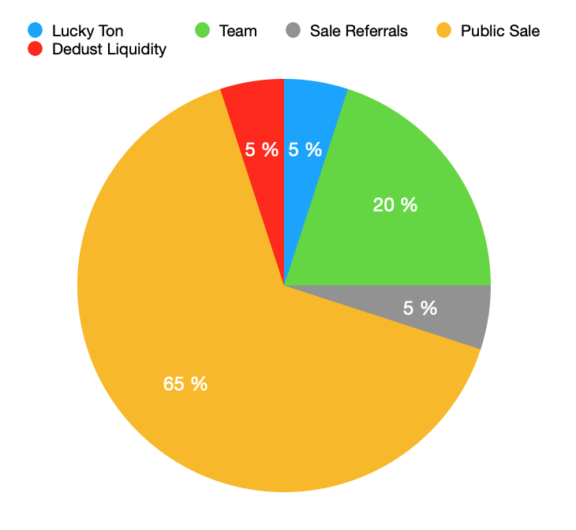
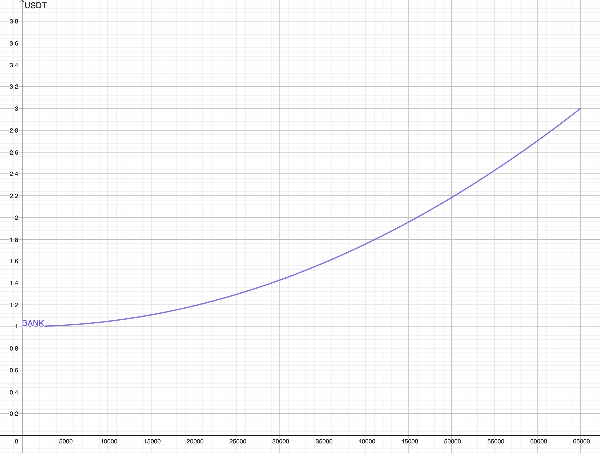

# Токеномика

## Общее предложение токенов

Общее количество токенов $BANK: **100 000**.

***

## Распределение токенов

| Категория            | Количество токенов | Доля от общего предложения |
| -------------------- | ------------------ | -------------------------- |
| **Lucky Ton**        | 5 000              | 5%                         |
| **Team**             | 20 000             | 20%                        |
| **Sale Referrals**   | 5 000              | 5%                         |
| **Dedust Liquidity** | 5 000              | 5%                         |
| **Public Sale**      | 65 000             | 65%                        |
| **Итого**            | 100 000            | 100%                       |

***

## Диаграмма распределение токенов

***

<figure><figcaption></figcaption></figure>

## Описание распределения

### **1. Lucky Ton (5%)**

* Токены выделены для стимулирования якорного партнера.
* Будут распределяться с вестингом на 12 месяцев.
* По окончанию вестинга будут размещены в постоянный стейкинг.

### **2. Team (20%)**

* Токены зарезервированы для команды проекта.
* Будут распределяться с вестингом на 12 месяцев.
* По окончанию вестинга будут размещены в постоянный стейкинг.

### **3. Sale Referrals (5%)**

* Токены для вознаграждения участников реферальной программы.
* Стимулируют привлечение новых пользователей на платформу.

### **4. Dedust Liquidity (5%)**

* Токены для обеспечения ликвидности на децентрализованныой бирже Dedust.
* Будут добавлены в пулы ликвидности для обеспечения стабильности торгов.

### **5. Public Sale (65%)**

* Токены для публичной продажи.
* Продажа будет проходить по **квадратичной кривой**, чтобы обеспечить справедливое распределение и стимулировать ранних участников.

***

## Механизм Public Sale

### **Квадратичная кривая**

Цена токена $BANK

&#x20;будет увеличиваться по квадратичной кривой в зависимости от проданного количества токенов. Формула для расчета цены:

$$
\text{Price} = \text{START_PRICE} + \left( \frac{\text{Reserve}}{\text{TotalSupply}} \right)^2 \times \text{PRICE_DIFFERENCE}
$$

Где:

* **START\_PRICE** = 1 USDT.
* **TotalSupply** = 65 000 токенов.
* **PRICE\_DIFFERENCE** = 2 USDT.

***

### **Пример расчета цены**

1. **Начало продажи**:
   * Резерв: 0 USDT.
   * Цена токена: 1 USDT.
   * Пользователь отправляет 100 USDT и получает 100 токенов.
2.  **После продажи 32 500 токенов**:

    * Резерв: 32 500 USDT.
    *   Цена токена:&#x20;

        $$
        [\frac{100}{1.5} \approx 66.67 \text{ токенов}.]
        $$

        \

        $$
        \text{Price} = 1 + \left( \frac{32,500}{65,000} \right)^2 \times 2 = 1 + 0.25 \times 2 = 1.5 \text{ USDT}.
        $$

    *   Пользователь отправляет 100 USDT и получает:&#x20;

        $$
        [\frac{100}{1.5} \approx 66.67 \text{ токенов}.]
        $$
3. **Конец продажи**:
   * Резерв: 65 000 USDT.
   *   Цена токена:&#x20;

       $$
       \text{Price} = 1 + \left( \frac{65,000}{65,000} \right)^2 \times 2 = 1 + 2 = 3 \text{ USDT}.
       $$

       \

***

### **Общая выручка**

Общая выручка от Public Sale составит:&#x20;

$$
\text{TotalRevenue} = \text{START_PRICE} \times \text{TotalSupply} + \frac{\text{PRICE_DIFFERENCE} \times \text{TotalSupply}}{3}
$$

$$
= 1 \times 65\,000 + \frac{2 \times 65\,000}{3}
$$

$$
= 65\,000 + 43\,333.\overline{3} = 108\,333.\overline{3} \text{ USDT}.
$$

***

## График изменения цены

***

<figure><figcaption></figcaption></figure>

## Распределение вырученных средств

| Категория                      | Сумма (USDT) | Доля от выручки |
| ------------------------------ | ------------ | --------------- |
| **Фонд оплаты труда**          | 30 000       | 27.7%           |
| **Инфраструктура**             | 2 400        | 2.2%            |
| **Маркетинг**                  | 24 000       | 22.2%           |
| **Ликвидность Dedust**         | 5 800        | 5.4%            |
| **Bug Bounty**                 | 5 000        | 4.6%            |
| **Пул кредитования**           | 20 000       | 18.5%           |
| **Непредвиденные расходы**     | 21 133       | 19.5%           |
| **Итого (без непредвиденных)** | 87 200       | 80.5%           |
| **Итого**                      | 108 333      | 100%            |

***

## Заключение

Токеномика проекта Lucky Bank разработана для обеспечения справедливого распределения токенов и стимулирования всех участников экосистемы. Public Sale по квадратичной кривой позволяет ранним участникам получить выгоду от более низкой цены, а поздним — участвовать на прозрачных условиях. Вырученные средства будут направлены на развитие платформы, маркетинг, обеспечение ликвидности и создание пула кредитования.
