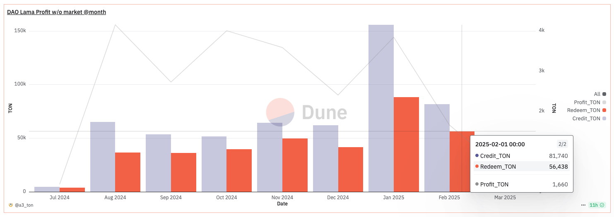
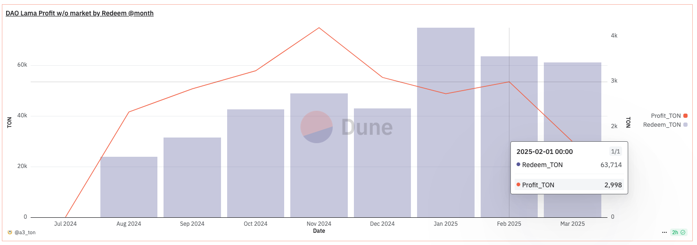
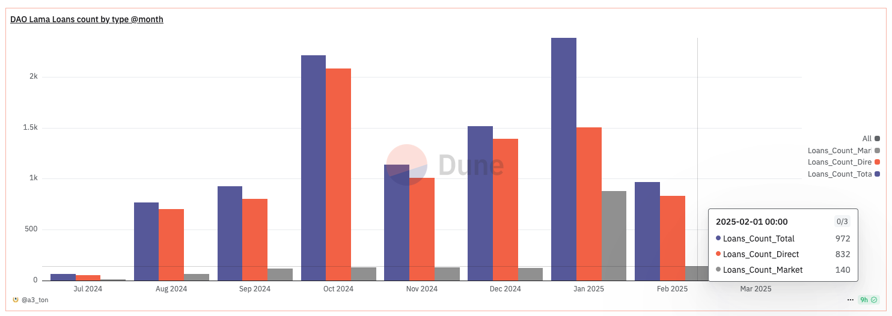
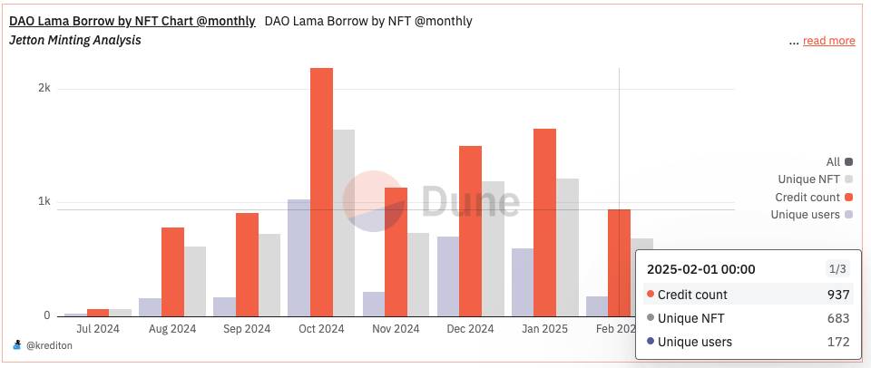
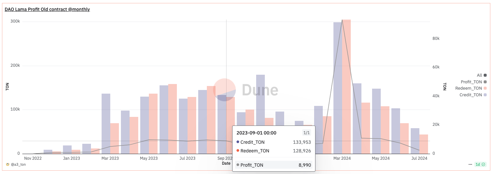
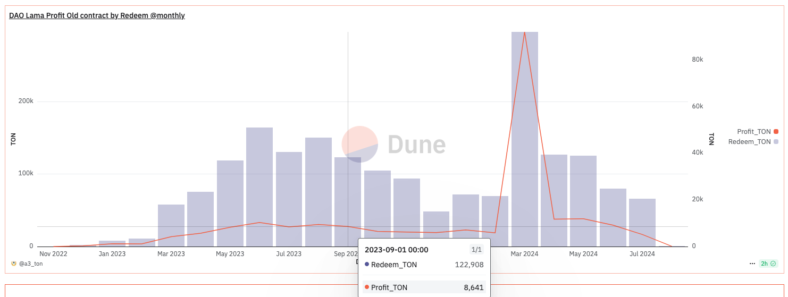
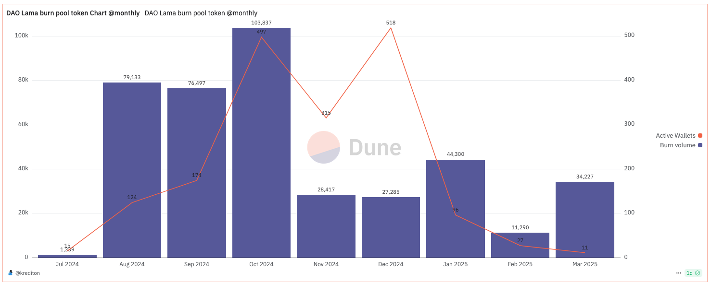
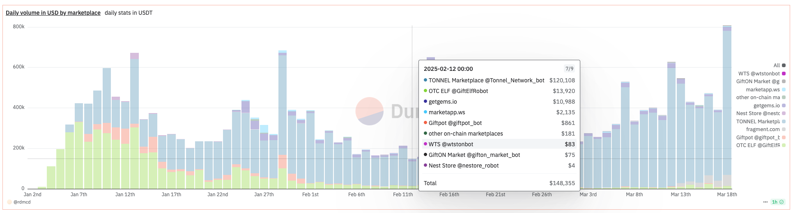

# Market Analysis

## NFT Collateral Lending Services

### 1. TON Lombard Bot (Frozen)

The first NFT collateral lending service and one of the oldest in the TON network. It was launched on June 17, 2022, as a Telegram bot. The service provided peer-to-peer lending, essentially off-chain, through a guarantor wallet built into the bot. In July 2023, pool-to-peer lending was implemented on the same technology, allowing pool replenishment and additional profit for project holders.

In August 2023, the bot was hacked, and all pool funds and collateral NFTs were withdrawn, resulting in a loss of approximately 20,000 TON. The project founder, lacking personal funds to cover the losses and restart the bot, sought help from major project holders. Six major holders formed a group (creating the Krediton project) and provided the founder with a loan, allowing him to settle almost all claims from those affected by the hack.

Krediton also developed a smart contract system for peer-to-peer lending. On February 25, 2024, the service was successfully relaunched with new technology. A little over a month after the relaunch, the project was sold to a new owner. Under the new management, the project went dormant and is currently non-operational.

### 2. DAOLama

The first pool-to-peer NFT collateral lending service in the TON network. It was launched on December 1, 2022, using a mixed technology: the decision to issue a loan is made by a server, while the loan issuance/repayment process is handled by a smart contract. In addition to lending, the service offers NFT rentals and a marketplace limited to loanable collections.

On July 29, 2024, a lending pool was implemented, open for replenishment by anyone. After the TON Lombard hack (August 2023) and until the release of Krediton Lending Tool on the mainnet (December 2024 - January 2025), DAOLama remained the monopoly in the TON lending market.

### 3. Scroogers Bank

Launched on January 14, 2025. It operates based on Krediton Lending Tool.


**Krediton Lending Tool** is a B2B tool that allows owners of NFT collections or large Telegram channels to create their own pool-to-peer lending service in TON/USDT against NFT collateral. The first MVP was launched in the testnet in March 2024 as part of continued support for the TON Lombard project. It became a semi-finalist in The Open League Hackathon'2024 (top 100 projects out of nearly 1000).


***

## Financial Indicators

### 1. DAOLama


The data below does not claim to be absolutely accurate, and there may be serious errors due to the lack of publicly available documentation on the project's smart contract protocols.


<figure><figcaption>
Volume of issued loans, repayments, and profit. Data is grouped by loan issuance date. Profit and repayments in this sample are calculated without considering marketplace purchase loans.
</figcaption></figure>

During the entire contract usage period, 587,427 TON were issued (including marketplace loans), with a profit of 23,180 TON (excluding marketplace loans).

<figure><figcaption>
Volume of loan repayments and profit. Data is grouped by repayment/extension date. Profit and repayments in this sample are calculated without considering marketplace purchase loans.
</figcaption></figure>

<figure><figcaption>
Total number of loans issued, loans against existing collateral, and loans for marketplace purchases by month.
</figcaption></figure>

<figure><figcaption>
Total number of loans issued, unique NFTs used as collateral, and unique wallets that received loans by month. Data is sourced from a different table, so the results differ from the previous ones but follow the same trend.
</figcaption></figure>

During the entire contract usage period, 9,891 loans were issued, involving 1,856 unique wallets and 4,631 unique NFTs.

<figure><figcaption>
Data from the old pool contract used before July 2024. There is an anomaly in the March 2024 data, so it should be ignored. Volume of issued loans, repayments, and profit. Data is grouped by loan issuance date. Profit and repayments in this sample are calculated without considering marketplace purchase loans.
</figcaption></figure>

<figure><figcaption>
Data from the old pool contract used before July 2024. There is an anomaly in the March 2024 data, so it should be ignored. Volume of loan repayments and profit. Data is grouped by repayment/extension date. Profit and repayments in this sample are calculated without considering marketplace purchase loans.
</figcaption></figure>

<figure><figcaption>
Volume of liquidity supplied to the lending pool (expressed in LP tokens) and the number of unique wallets that made deposits.
</figcaption></figure>

<figure><figcaption>
Volume of liquidity withdrawn from the lending pool (expressed in LP tokens) and the number of unique wallets that made withdrawals.
</figcaption></figure>

### 2. TON Lombard Bot (Frozen)

Currently inactive. As the project was an off-chain service, historical data is not publicly available. Only a screenshot of the admin panel, taken by the original founder after the bot was hacked, is available (received along with the offer to sell the service).

<figure><figcaption></figcaption></figure>

### 3. Scroogers Bank

The project's lifespan is too short for objective data analysis.

### 4. Telegram Gifts

<figure><figcaption>
Daily trading volume of Telegram Gifts in USDT.
</figcaption></figure>

Total trading volume: 6,259,937 TON, unique users: 69,582 (as of 19.03.2024).

***

## Conclusions


For calculations, we will use the exchange rate of 1 TON = 3 USDT.


### 1. Pool-to-peer Lending

It is very difficult to conduct a qualitative analysis with such "volatile" data. These fluctuations are related to marketing campaigns, such as participation in the TON Open League. Therefore, for analysis, we will rely only on February 2025, when no such campaigns were conducted, and the data is relatively fresh. If we compare this data with 2023 data, we can see that lending volumes (expressed in TON) have remained almost the same, while profit has decreased by almost three times. Thus, we can conclude that this market niche is not growing, and to capture a share of it, one must enter into fierce competition. Currently, monthly profit is around 12-15,000 USDT, which can be considered 15-20% above the breakeven point. Given this, the emergence of a new player in this niche, even at 25%, would cause irreparable harm to current players.

We would prefer to avoid such developments, so we will not promote pool-to-peer lending functionality but will keep it as a secondary feature. Estimated monthly revenue from this type of lending by April 2026 could be:
- **Realistic scenario**: 1000 USDT
- **Pessimistic scenario**: 250 USDT

### 2. Peer-to-peer Lending

If we look at the lending volume chart from July to October 2023, we do not see significant changes before/after August 2023 (the Lombard hack). Thus, we can cautiously assume that the pool-to-peer and peer-to-peer lending niches do not overlap. Estimated (assuming the Lombard income data is accurate) monthly revenue from this type of lending by April 2026 could be:
- **Realistic scenario**: 3000 USDT
- **Pessimistic scenario**: 1500 USDT

### 3. AMM Telegram Gifts Lending

If we compare the annual lending market volume with the sales volume of Telegram Gifts (over three months), we see that they differ by an order of magnitude (1.8 million vs. 19.3 million USDT), and the number of unique wallets differs by 37 times (1.8 thousand vs. 68 thousand). At the same time, the proposed AMM model is unique to this market, and there will be no need to enter into direct competition with current players. Estimated monthly revenue from this type of lending by April 2026 could be:
- **Realistic scenario**: 10,000 USDT
- **Pessimistic scenario**: 2000 USDT

### Summary

In summary, the estimated monthly revenue from all types of lending by April 2026 could be:
- **Realistic scenario**: 14,000 USDT
- **Pessimistic scenario**: 3750 USDT