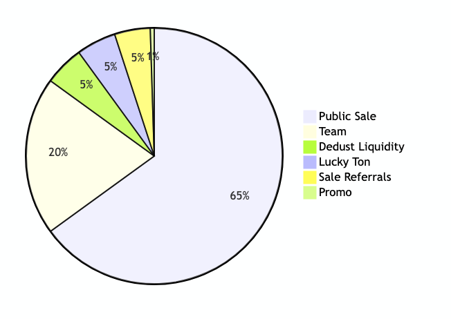

# Tokenomics

## Total Token Supply

Ticker: _**$BANK**_\
Total Token Supply: **100,000**\
Master Contract Address: [**EQB1399hPqWDdupmVw43dKBEgYgsEtoliVGsfpchiHC-BANK**](https://tonviewer.com/EQB1399hPqWDdupmVw43dKBEgYgsEtoliVGsfpchiHC-BANK)\
Owner: _**Revoked**_\
ICO Format: _**Quadratic Curve. Start at 1 USDT. End at 3 USDT.**_

***

## Token Distribution

| Category             | Number of Tokens | Percentage of Total Supply |
| -------------------- | ---------------- | -------------------------- |
| **Public Sale**      | 65,000           | 65%                        |
| **Team**             | 20,000           | 20%                        |
| **Dedust Liquidity** | 5,000            | 5%                         |
| **Lucky Ton**        | 5,000            | 5%                         |
| **Sale Referrals**   | 4,500            | 4.5%                       |
| **Promo**            | 500              | 0.5%                       |
| **Total**            | 100,000          | 100%                       |

***

## Token Distribution Chart

<figure><figcaption></figcaption></figure>

<figure><figcaption></figcaption></figure>

***

## Distribution Description

### **1. Public Sale (65%)**

* Tokens for public sale.
* The sale will follow a **quadratic curve** to ensure fair distribution and incentivize early participants.

### **2. Team (20%)**

* Tokens reserved for the project team.
*   Distributed with a 1-year vesting period. Will be unlocked on 12.04.2026.

    _Vesting Smart Contract Address:_ [_EQBEU618M4KkoHm8-Rmrse-BDcQ\_FqnqrKyOrcPUH8iwn7eT_](https://tonviewer.com/EQBEU618M4KkoHm8-Rmrse-BDcQ_FqnqrKyOrcPUH8iwn7eT)

### **3. Dedust Liquidity (5%)**

* Tokens for providing liquidity on the decentralized exchange Dedust.
* Will be added to liquidity pools to ensure trading stability.
* The obtained LP tokens will be sent to a null address.

### **4. Lucky Ton (5%)**

* Tokens allocated to incentivize the parent project.
*   Distributed with a 1-year vesting period. Will be unlocked on 12.04.2026.

    _Vesting Smart Contract Address:_ [_EQBj8YwOWEEHc77VCO0VetBTHjNcJopa2hCqF1plUvuNMGZw_](https://tonviewer.com/EQBj8YwOWEEHc77VCO0VetBTHjNcJopa2hCqF1plUvuNMGZw)

### **5. Sale Referrals (4.5%)**

* Tokens for rewarding participants in the referral program.
* Encourages attracting new users to the platform.

### **6. Promo (0.5%)**

* Tokens allocated for promotion among long-term partners.

***

## ICO Milestones

<figure><figcaption></figcaption></figure>

### Soft Cap

The soft cap for the public sale is 5000 $BANK and is limited to the date 12.04.2025. If the required number of tokens is not sold by the specified date, all funds raised will be fully refunded to the buyers.

### Dedust WL

The threshold for creating a liquidity pool on the decentralized exchange Dedust is 35000 $BANK.

### Hard Cap

The hard cap for the public sale is all allocated 65000 $BANK and is limited to the date 12.04.2026. If all tokens are not sold by the specified date, the remaining tokens will be burned. Additionally, all unclaimed tokens allocated for referral rewards will also be burned.

***

## Public Sale Mechanism

### **Quadratic Curve**

The price of the $BANK token will increase according to a quadratic curve based on the number of tokens sold. The formula for calculating the price is:

$$
\text{Price} = \text{START\_PRICE} + \left( \frac{\text{Reserve}}{\text{TotalSupply}} \right)^2 \times \text{PRICE\_DIFFERENCE}
$$

Where:

* **START\_PRICE** = 1 USDT.
* **TotalSupply** = 65,000 tokens.
* **PRICE\_DIFFERENCE** = 2 USDT.

***

### Price Change Chart

<figure><figcaption></figcaption></figure>

***

### **Price Calculation Example**

1. **Start of Sale**:
   * Reserve: 0 USDT.
   * Token Price: 1 USDT.
   * A user sends 100 USDT and receives 100 tokens.
2. **After Selling 32,500 Tokens**:
   * Reserve: 32,500 USDT.
   *   Token Price:

       $$
       \text{Price} = 1 + \left( \frac{32,500}{65,000} \right)^2 \times 2 = 1 + 0.25 \times 2 = 1.5 \text{ USDT}.
       $$
   *   A user sends 100 USDT and receives:

       $$
       \frac{100}{1.5} \approx 66.67 \text{ tokens}.
       $$
3. **End of Sale**:
   * Reserve: 65,000 USDT.
   *   Token Price:

       $$
       \text{Price} = 1 + \left( \frac{65,000}{65,000} \right)^2 \times 2 = 1 + 2 = 3 \text{ USDT}.
       $$

***

### **Total Revenue**

The total revenue from the Public Sale will be:

$$
\text{TotalRevenue} = \text{START\_PRICE} \times \text{TotalSupply} + \frac{\text{PRICE\_DIFFERENCE} \times \text{TotalSupply}}{3}
$$

$$
= 1 \times 65\,000 + \frac{2 \times 65\,000}{3}
$$

$$
= 65\,000 + 43\,333.\overline{3} = 108\,333.\overline{3} \text{ USDT}.
$$

***

## Conclusion

The tokenomics of the Lucky Bank project are designed to ensure fair token distribution and incentivize all ecosystem participants. The Public Sale using a quadratic curve allows early participants to benefit from a lower price, while late participants can join under transparent conditions. The funds raised will be directed towards platform development, marketing, liquidity provision, and the creation of a lending pool.
