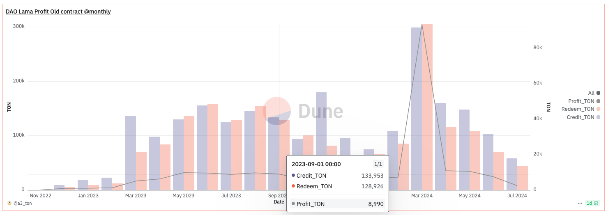
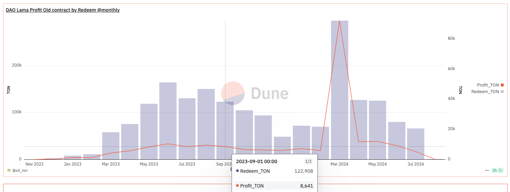
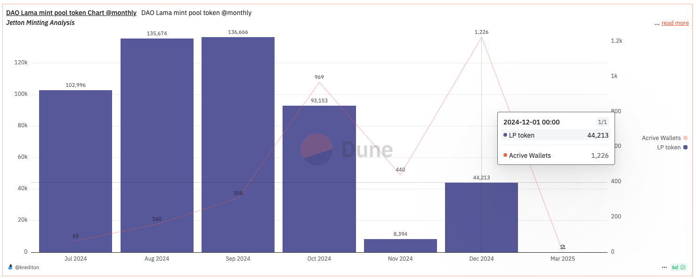
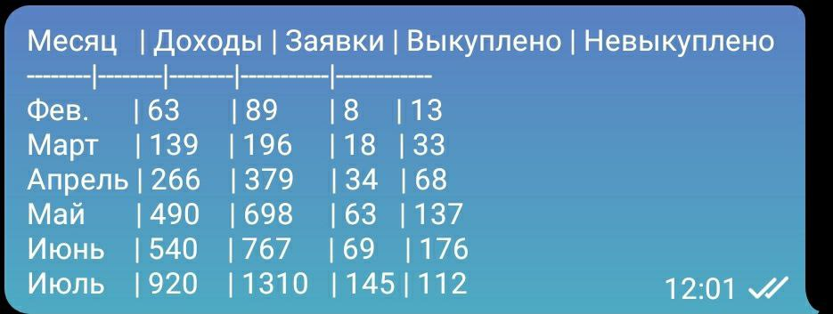

# Анализ рынка

## Сервисы кредитования под залог NFT

### 1. TON Lombard Bot (Frozen)

Первый сервис кредитования под залог NFT и один из старейших в сети TON. Был запущен 17 июня 2022 года в виде Telegram-бота. Сервис осуществлял peer-to-peer кредитование фактически off-chain через гарант-кошелёк, встроенный в бота. В июле 2023 года на этой же технологии было реализовано pool-to-peer кредитование с возможностью пополнения пула и получения дополнительной прибыли холдерами проекта.

В августе 2023 года бот был взломан, все средства пула и залоговые NFT были выведены, ущерб составил порядка 20 тыс. TON. Фаундер проекта, не имея собственных средств на возмещение убытков и перезапуск бота, обратился за помощью к крупным холдерам проекта. Шесть крупных холдеров объединились в группу (образовав тем самым проект Кредитон) и прокредитовали фаундера, что позволило ему урегулировать практически все претензии пострадавших от взлома.

Кредитон также создал систему смарт-контрактов для peer-to-peer кредитования. 25 февраля 2024 года сервис был успешно перезапущен на новой технологии. Через месяц с небольшим после перезапуска проект был перепродан новому владельцу. Под новым руководством проект ушёл в спячку и на данный момент не функционирует.

### 2. DAOLama

Первый сервис кредитования под залог NFT в формате pool-to-peer в сети TON. Был запущен 1 декабря 2022 года на смешанной технологии: решение о выдаче кредита принимает сервер, а сам процесс получения/погашения займа происходит на основе смарт-контракта. Помимо кредитования, реализован сервис аренды NFT и маркетплейс, ограниченный кредитуемыми коллекциями.

29 июля 2024 года был реализован пул кредитования, доступный для пополнения всем желающим. После взлома TON Lombard (август 2023) и до выхода Krediton Lending Tool в мейннет (декабрь 2024 - январь 2025) оставался монополистом на рынке кредитования в сети TON.

### 3. Scroogers Bank

Был запущен 14 января 2025 года. Работает на основе Krediton Lending Tool.


**Krediton Lending Tool** — это B2B-инструмент, позволяющий владельцам NFT-коллекций или крупных Telegram-каналов создать собственный pool-to-peer сервис кредитования в TON/USDT под залог NFT. Первый MVP в тестнете был запущен в марте 2024 года в рамках продолжения поддержки проекта TON Lombard. Стал полуфиналистом в The Open League Hackathon'2024 (топ 100 проектов из почти 1000).


***

## Финансовые показатели

### 1. DAOLama


Приведённые ниже данные не претендуют на абсолютную точность, а также в них могут встречаться серьёзные ошибки из-за отсутствия в общем доступе документации протоколов смарт-контрактов проекта.


<figure><figcaption>
Объём выданных кредитов, произведённые погашения и профит. Данные сгруппированы по дате выдачи кредита. Профит и погашение в этой выборке рассчитаны без учёта кредитования покупок на маркете.
</figcaption></figure>

За всё время использования контракта было выдано 587 427 TON (с учётом маркета), получен профит 23 180 TON (без учёта маркета).

<figure><figcaption>
Объём произведённых погашений кредитов и профит. Данные сгруппированы по дате погашения/продления кредита. Профит и погашение в этой выборке рассчитаны без учёта кредитования покупок на маркете.
</figcaption></figure>

<figure><figcaption>
Общее количество выданных кредитов, кредитов под уже имеющийся залог, кредитов под покупку на маркете по месяцам.
</figcaption></figure>

<figure><figcaption>
Общее количество выданных кредитов, количество уникальных NFT, поступивших в залог, уникальных кошельков, получивших кредит, по месяцам. Данные получены из другой таблицы, поэтому результаты отличаются от предыдущих, но имеют тот же порядок.
</figcaption></figure>

За всё время использования контракта было выдано 9891 кредит, 1856 уникальных кошельков и 4631 уникальная NFT.

<figure><figcaption>
Данные со старого пул-контракта, использовавшегося до июля 2024 года. В данных за март 2024 года существует аномалия, поэтому необходимо её проигнорировать. Объём выданных кредитов, произведённые погашения и профит. Данные сгруппированы по дате выдачи кредита. Профит и погашение в этой выборке рассчитаны без учёта кредитования покупок на маркете.
</figcaption></figure>

<figure><figcaption>
Данные со старого пул-контракта, использовавшегося до июля 2024 года. В данных за март 2024 года существует аномалия, поэтому необходимо её проигнорировать. Объём произведённых погашений кредитов и профит. Данные сгруппированы по дате погашения/продления кредита. Профит и погашение в этой выборке рассчитаны без учёта кредитования покупок на маркете.
</figcaption></figure>

<figure><figcaption>
Объём поставки ликвидности в пул кредитования (выраженный в LP-токенах) и количество уникальных кошельков, производивших внесение.
</figcaption></figure>

<figure><figcaption>
Объём изъятия ликвидности из пула кредитования (выраженный в LP-токенах) и количество уникальных кошельков, производивших изъятие.
</figcaption></figure>

### 2. TON Lombard Bot (Frozen)

На текущий момент деятельность не ведётся. Так как проект был off-chain сервисом, данные за предыдущие периоды в свободном доступе отсутствуют. Доступен только скриншот админки, сделанный первым фаундером после взлома бота (получен вместе с предложением о продаже сервиса).

<figure><figcaption></figcaption></figure>

### 3. Scroogers Bank

Слишком короткий срок жизнедеятельности проекта для объективного анализа данных.

### 4. Telegram Gifts

<figure><figcaption>
Ежедневный объем торговли Telegram Gifts в USDT.
</figcaption></figure>

Общий объём торговли 6 259 937 TON, уникальных пользователей 69 582 (на 19.03.2024).

***

## Выводы


При расчётах будем оперировать курсом 1 TON = 3 USDT.


### 1. Pool-to-peer кредитование

Очень сложно провести качественный анализ на таких "прыгающих" данных. Такие "прыжки" связаны с проведением маркетинговых акций, например, участие в TON Open League. Поэтому для анализа будем опираться только на февраль 2025 года, когда таких акций не проводилось и данные достаточно свежи. Если сравнить эти данные с данными за 2023 год, то мы увидим, что объёмы кредитования (выраженные в TON) остались практически на том же уровне, при этом профит сократился практически в 3 раза. Таким образом, можно сделать вывод, что этот рынок в этой нише не растёт, а для того чтобы занять на нём долю, необходимо входить в жёсткую конкуренцию. На данный момент ежемесячный профит находится в районе 12-15 000 USDT, что может оцениваться как превышающий на 15-20% точку безубыточности. Исходя из этого, появление нового игрока в этой нише хотя бы на 25% нанесёт непоправимый ущерб текущим игрокам.

Нам бы не хотелось развития таких событий, поэтому мы не будем продвигать функционал pool-to-peer кредитования, а оставим его как дополнительный/второстепенный. Оценочно ежемесячная доходность по данному виду кредитования к апрелю 2026 года может составить:
- **Реалистичный сценарий**: 1000 USDT
- **Пессимистичный сценарий**: 250 USDT

### 2. Peer-to-peer кредитование

Если посмотреть на диаграмму объёма кредитования в период с июля по октябрь 2023 года, то мы не увидим каких-то значительных изменений до/после августа 2023 (взлом Ломбарда). Таким образом, можно осторожно предположить, что ниши pool-to-peer и peer-to-peer кредитования не пересекаются. Оценочно (при условии, что данные по доходам Ломбарда верны) ежемесячная доходность по данному виду кредитования к апрелю 2026 года может составить:
- **Реалистичный сценарий**: 3000 USDT
- **Пессимистичный сценарий**: 1500 USDT

### 3. AMM кредитование Telegram Gifts

Если сравнить годовой объём рынка кредитования с объёмом продаж Telegram Gifts (за три месяца), то мы увидим, что они отличаются на порядок (1,8 млн. против 19,3 млн. USDT), а количество уникальных кошельков отличается в 37 раз (1,8 тыс. против 68 тыс.). При этом предлагаемая модель AMM уникальна для этого рынка, и входить в прямую конкуренцию с текущими игроками не придётся. Оценочно ежемесячная доходность по данному виду кредитования к апрелю 2026 года может составить:
- **Реалистичный сценарий**: 10 000 USDT
- **Пессимистичный сценарий**: 2000 USDT

### Итог

Подводя итоги, оценочно ежемесячная доходность по всем видам кредитования к апрелю 2026 года может составить:
- **Реалистичный сценарий**: 14 000 USDT
- **Пессимистичный сценарий**: 3750 USDT